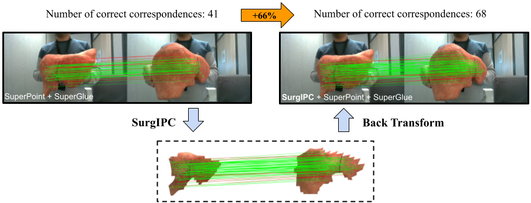

This repository provides the official implementation for the paper:

> **SurgIPC: a Convex Image Perspective Correction Method to Boost Surgical Keypoint Matching**  
> *Rasoul Sharifian, Adrien Bartoli*  
> Published in *International Journal of Computer Assisted Radiology and Surgery (IJCARS), 2025*  
> 📄 [Read the Paper](https://encov.ip.uca.fr/publications/pubfiles/2025_Sharifian_etal_IJCARS_flattening.pdf)  
> 🎥 [Presentation Video (optional)](https://link-to-video.com)

  
*SurgIPC cancels the effect of perspective and boosts the number of correct correspondences. In this example, SurgIPC is added to SuperPoint-SuperGlue and boosts matching by 66\% (correspondences validated using  the camera ground-truth).*


---

## 🧠 Overview
Keypoint detection and matching is a fundamental step in surgical image analysis. However, existing methods are not perspective invariant and thus degrade with increasing surgical camera motion amplitude. One approach to address this problem is by warping the image before keypoint detection. However, existing warping methods are inapplicable to surgical images, as they make unrealistic assumptions such as scene planarity. 

We propose Surgical Image Perspective Correction (SurgIPC), a convex method, specifically a linear least-squares (LLS) one, overcoming the above limitations. Using a depthmap, SurgIPC warps the image to deal with the perspective effect. The warp exploits the theory of conformal flattening: it attempts to preserve the angles measured on the depthmap and after warping, whilst mitigating the effects of image resampling.

---

## 🗂️ Repository Structure

```bash
SurgIPC/
├── 1_DataPreparation/               # required input data
├── 2_DataPreprocessing/              # generating requested masks
├── 3_Flattening/                # Flattening
├── 4_Warping/                # warping the images
├── 5_Evaluation/               # Keypoint matching evaluation
├── images/                 # images used in this repo


@article{sharifian2025surgipc,
  title     = {SurgIPC: a Convex Image Perspective Correction Method to Boost Surgical Keypoint Matching},
  author    = {Sharifian, Rasoul and Bartoli, Adrien},
  journal   = {International Journal of Computer Assisted Radiology and Surgery},
  year      = {2025}
}

